## Cash Issuer Design

### **Background**

Corda allows members of the same compatibility zone to transact seamlessly across different asset classes on one platform. This in itself is a huge step forward in the blockchain space.  However the full potential of blockchain is realised when participants can execute atomic transactions involving both digital assets and digital cash.  Without an on-ledger medium of exchange, members of the Corda Network must settle their obligations by finding a coincidence of wants (digital barterning), or taking the settlement obligation to another ledger for settlement.  Corda does and will continue to include tools to help users settle obligations on any rails, using:

* a two-phase commit protocol, 
* and a high level of proof that off-ledger settlement actually occurred (which may require enhancements in traditional payment rails and core banking systems)

The full potential of blockchain technology will be realised when members of a Corda compatibility zone can extinguish obligations which arise on ledger, with an on-ledger digital representation of fiat currency. This is what R3 has termed "cash on ledger". Most implementations of cash on ledger require a legal entity which bridges the traditional banking system with the Corda compatibility zone — this is the role of the "Issuer" node. 

### Types of cash on ledger

Broadly, there are two different forms of cash in the economy:

- **Central bank money** which is a liability of national (or supra-national) central banks. It is manifested as physical notes and coins issued by the central bank, or digital reserves held by commercial banks in the same jurisdiction as the central bank. Commercial banks use these reserves as capital, as well as for settling payments with customers at other banks in the same jurisdiction.
- **Commercial bank money** which is a liability of commercial banks. It is manifested as deposits with commercial banks and is created when banks extend loans to customers. Conversely, it is destroyed when customers pay back loans. As such, commercial bank money is just a number in a commercial bank's accounting system.

It is useful to depict the relationship between central bank money and commercial bank money. As can be seen, the majority of money in circulation is manifested as commercial bank deposits. 

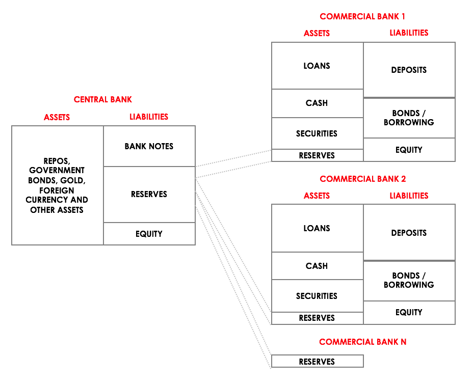

Today, it is only commercial banks which have access to central bank reserves, although there are some exceptions. As such, non-banks can only hold and transact with commercial bank money. Central bank digital currency ("CBDC") initiatives, where non-banks can hold and transact in central bank reserves have been discussed but there are no credible implementations on the horizon. 

There are some assumptions to be made about issuance of each type of money:

#### Central bank money

* It is generally assumed that central bank money is "credit risk free"—that is, the central bank will always stand behind their liabilities
* The users of central bank money states will only be commercial banks (for now)
* It is currently unclear to us how central banks manage their internal accounts and such systems likely differ between the central banks. Nevertheless, there are only small numbers of commercial banks but we anticipate that on-boarding banks to such a platform would be a long and tedious process
* Central bank reserve movements are always in the context of individual bank customer payments or the net payment flows between customers at different banks. The interbank payments must be linked to batches of customer payments
* There can only be one issuer per currency—the central bank

#### Commercial bank money

* The users of commercial bank money states are corporates and individuals, as opposed to banks
* There can be multiple issuers per currency zone—in the absence of legal agreements it would not be expected that cash states from different issuers would be fungible 
* Commercial bank money states can be issued directly by commercial banks or by non-banks (with the appropriate licences) that hold bank accounts with commercial banks
* It is likely that issuers would onboard large amounts of customers and customer due diligence must be performed for each customer
* All commercial bank money is held is numbered commercial bank deposit accounts. Although there are different formats from country to country, each bank account is universally accessible via a number and some additional routing information. As such, it is a reasonable assumption for issuers to store mappings of bank account numbers to Corda identities as a means of bridging the banking system and Corda compatibility zone
* Commercial bank money is subject to the credit risk of the commercial bank holding the underlying bank deposit—if the bank fails, it is likely that funds will be lost
* Commercial bank money of a particular currency can only exist in the deposit accounts of banks in that currency zone—for example, GBP cannot exist in bank accounts outside of the UK. Indeed, one of the reasons to create a digital representation of commercial bank money is because these cash states representing commercial bank money of a particular currency can exist in the vault of Corda nodes in _any_ country.
* Issuance of "electronic money" instruments in most jurisdictions is a regulated activity and comes with a series of onerous regulatory obligations.

#### Other models

It is possible to use a different approach where instead of holding commercial bank deposits or central bank reserve deposits, the issuer can hold securities of one type (or many types) and issue notes (which are also securities) as liabilities against those securities on the asset side of the balance sheet. This model allows issuers to issue state objects in respect of any type of asset. 

This model can be used to issue "cash-like" state objects. For example, if the issuer wishes to issue a US Dollar-like instrument it can hold US treasuries on the asset side and issue notes which approximate the value of a US Dollar. It is likely, though, that such an instrument would be regarded as a security in most regulatory jurisdictions. The issuer would likely have to take on some interest rate risk if the holders of cash states issued by such an SPV were to have a guaranteed value.

### High level architecture

Whilst this document aims to present the design of a generic cash issuer framework, the reference implementation will be focused on: 

* commercial bank money issuance
* an issuer node located _outside_ of commercial bank infrastructure

It is worth noting that the approach described below is just one way to implement the issuer node. For example, if the issuer node was located _inside_ a commercial bank's infrastructure, the legacy payments interfaces would differ.

So, what follows is a the design for a generic cash issuer architecture as well as a reference implementation focused on issuing commercial bank backed liabilities via multiple commercial banks. The cash issuer comprises two main components:

1. the **issuer node** which is a Corda node running the cash issuer CorDapp, and
2. multiple **issuer daemons**, which are middleware that interfaces with different kinds of legacy banking infrastructure such as HTTP APIs, MQ end-points, SFTP servers and SWIFT payment gateways.

It is intended that multiple cash issuers of different, as well as the same currencies, can be supported within a Corda compatibility zone, where each cash issuer would be manifested as a business network operator within the compatibility zone. Members of the compatibility zone can join multiple business networks, allowing them to transact with multiple asset and/or agreement types in the same transaction.

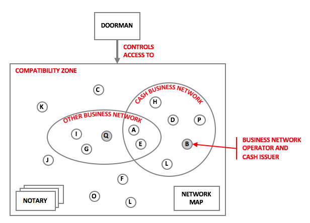

#### The cash issuer node 

The cash issuer node acts as a bridge between the corda realm and the banking realm. It is a piece of IT infrastructure which sits within a legal entity known as "the issuer". At a high level, the issuer performs three simple functions:

1. Receives payments of fiat currency into a bank account (which it controls) and issues corda cash states of equal value which can be used inside the compatibility zone
2. Safeguards the fiat currency which has been received from parties
3. Facilitates the redemption of cash states when they are no longer required and transfers the fiat currency bank to the party requesting the redemption

With "cash on ledger", parties holding cash states can settle their obligations, atomically, on-ledger. The diagram below illustrates this process where participant two requests to issue cash, makes a payment to participant one, who then redeems the cash states.

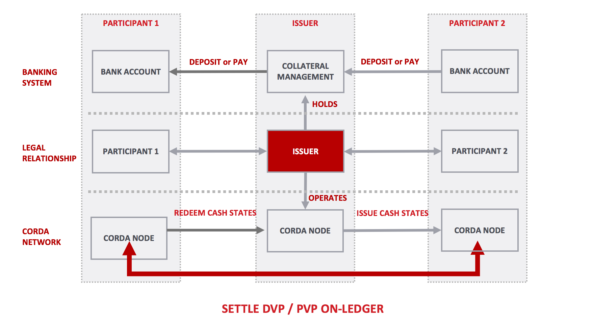

Legal agreements between the issuer and holders of corda cash states set out all the necessary rights and obligations of the issuer and the holders of cash states. To facilitate the above, the issuer must perform some other crucial processes.

*Mapping bank accounts to parties*

In order to facilitate issuances and redemptions, the issuer must maintain a mapping of bank accounts to parties. This is a key control which the issuer maintains. The issuer must know the source of payments into its nostro accounts in respect of issuances, and where payments should be sent in respect of redemptions. As such, prior to issuing or redeeming cash states, parties must register a bank account with the issuer. This is in the form of a digitally signed data structure, by the party in question, which is verified by the issuer node. 

Registering bank accounts is just one of a few approaches to map parties to payments. Other approaches include:

* Adding an issuer generated reference code to fund transfers from parties to the issuer. This allows the issuer to match codes to parties. This approach wasn't taken for the reference implementation, as entering a code for each issuance is error prone and makes the issuance process more complicated
* Issuing virtual account numbers to all parties — parties then make payments to these virtual account numbers to receive cash states. This approach requires an agency banking relationship which may not always be available for each commercial bank

*Keeping internal records*

The issuer must maintain a record of all transactions happening in its nostro accounts and, in addition, records of all issuances and redemptions. The set of issuances and redemption records is a proper subset of the set of transaction records from the nostro accounts, as not all transactions will pertain to issuances or redemptions. These records can be used to maintain a reconciliation between the nostro accounts and the issued cash states on Corda.

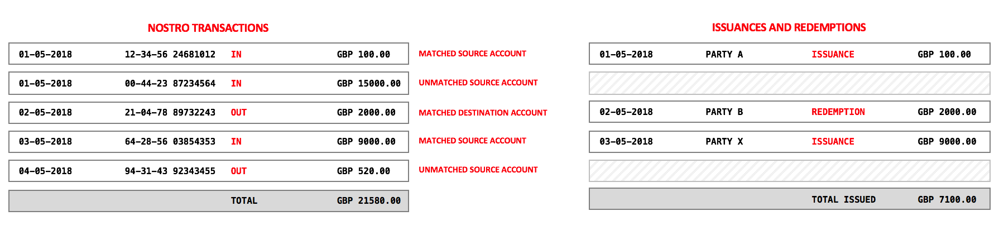

The diagram above depicts the relationship between nostro transactions and issuances/redemptions. As mentioned, not all nostro transactions pertain to issuances or issuances.

Reconciliations will be performed periodically to report that the total amount of issued cash states is always less than or equal to the sum of all the nostro account balances.

*Performing customer due diligence and transaction monitoring*

As per regulatory requirements, the issuer must perform due diligence over all potential users of its issued cash states. This is manifested as KYC during the customer on-boarding process as well as verifying that any bank accounts registered with the issuer are indeed owned by the submitter. The issuer also has a regulatory responsibility to perform transaction monitoring on an on-going basis. For now, it is assumed that this can take place retrospectively upon redemption of cash states. 

#### The issuer daemon

Issuer nodes can support multiple legacy payments interfaces via issuer daemons. Issuer daemons act as middleware that interfaces with different kinds of legacy banking infrastructure such as HTTP APIs, MQ end-points, SFTP servers and SWIFT payment gateways. The daemons perform all interaction with legacy infrastructure, such as polling for new payments, being notified of new payments via callbacks or initiating payment instructions. It is expected that multiple daemon implementations will be required for different banks, countries or jurisdictions. 

Daemons receive data in bank specific formats and transform the data into a common, bank agnostic, format understandable by the issuer node. The daemons connect to the Issuer node via RPC and receive instructions from the issuer node via tracked vault state updates. The daemons are designed to require minimal state, indeed, they do not persist any data to disk and can be bootstrapped via communication with the issuer node and bank interfaces. 

It is intended that daemons report _all_ transactions going in and out the accounts, this is because the issuer node cannot miss any transactions if it is to perform the issuer function effectively. A reconciliation can be periodically performed to check that all the required transactions have been recorded. If not then the daemon can request missing transactions.

At end of day, a checkpoints can be taken to avoid duplicating reconciliations of old data.

#### Relationship between the daemon and issuer node

The issuer node can only interact with bank services via daemons which have three primary jobs:

1. gather information about the issuer's nostro accounts
2. update the node with new transactions in and out of the nostro accounts
3. send payment instructions to the banks

The relationship between the bank interfaces, daemon and issuer node is depicted below.

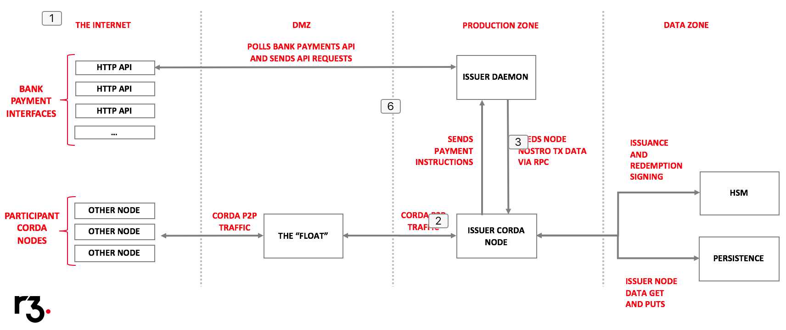

In the diagram above there is only one daemon process. However, the issuer node supports daemons of many type which all connect to the issuer node via client RPC.

#### CorDapp structure

The issuer comprises three CorDapps:

1. a commons app which contains common data structures and flows usable by both the issuer and and customers of the issuer
2. the service, which contains the issuer side of the issuance and redemption flows and core services for managing the issuer's internal records
3. a client app that contains the client side of flows which interact with the issuer

### Issuer data model 

As the issuer is a Corda node, it is appropriate to store all records as Corda states. This facilitates an audit trail of changes and allows for the use of contracts to enforce certain behaviours and facilitate matching of states.

#### Bank account states 

These states are created by the issuer node and parties that wish to issue cash on ledger. they contain bank account details and the party which the bank account belongs to. After creation, parties can send these bank account states to an issuer of their choice. Issuers can keep this data as a digitally signed record of the party's bank account details. More than one bank account state can be sent to an issuer. 

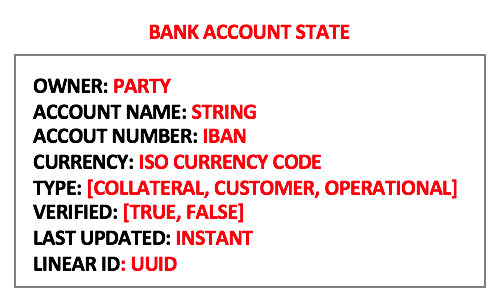

Bank account states created by the issuer include more properties than the ones created by regular parties. Issuers store some additional metadata, such as whether the bank account has been verified and the type of bank account. Collateral accounts are owned by the issuer and used by parties to deposit funds in exchange for cash states. Customer accounts are owned by parties registered with the issuer. Operational accounts are non-collateral accounts owned by the issuer.

#### Nostro transaction states

Nostro transaction states contain a record of a payment in or out of one of the nostro accounts controlled by the issuer. 

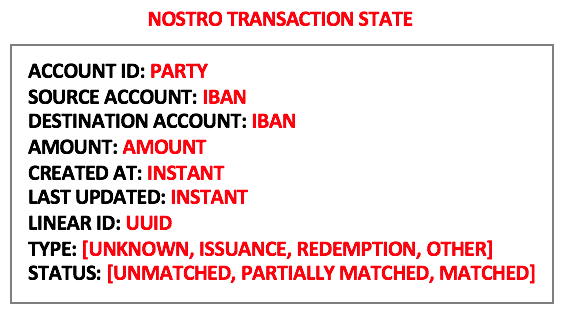

Nostro transaction information originates from an issuer daemon and is send to the issuer node via the `AddNostroTransaction` flow when a payment to or from one of the issuer's nostro accounts occurs. 

Nostro transactions also include a status regarding whether they have been matched to bank accounts. For example: If a nostro transaction state can be matched to a customer bank account and the payment is incoming to the nostro account then the payment is an issuance. 

When nostro transaction states are added to the node, they undergo a matching process via a separate flow called `ProcessNostroTransaction`, the logic is described in table format below.

| Source \ Destination             | Issuer's Collateral account | Known Customer account | Unknown customer account   | Issuer's operational account |
| -------------------------------- | --------------------------- | ---------------------- | -------------------------- | ---------------------------- |
| **Issuer's Collateral  Account** | Liquidity transfer          | Redemption             | ***Erroneous redemption*** | Income sweep                 |
| **Customer**                     | Issuance                    | N/a                    | N/a                        | N/a                          |
| **Unknown  account**             | Erroneous  transfer         | N/a                    | N/a                        | N/a                          |
| **Issuer's operational account** | Collateral account funding  | N/a                    | N/a                        | N/a                          |

#### Issuance states

For nostro transactions which end up resulting in issuances, an issuance state is created. Issuance states record details of which party cash states should be issued to and the nostro transaction state that prompted the issuance. Each issuance state maps back to a nostro transaction state as well as the matched bank account states. The cash issuance is performed in a separate transaction to the creation of the issuance state.

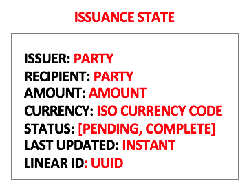

In future versions of the cash issuer CorDapp, it would be desirable to include the issuance state and the chain of provenance which led to its creation in the cash issuance transaction. However, this requires a generic transaction tear-off capability which is not currently available. Alternatively, notary batching would be be useful alternative which only allows the cash issuance to be performed, if and only if, the internal workflow is successfully completed.

#### Cash states

Cash states are created when the issuer is required to issue cash. The design of cash states is out of scope for this design document. At a basic level, the cash state contains the following properties:

* Amount
* Currency
* Issuer party
* Owner

#### Redemption states

Redemption states are created when the issuer receives a redemption transaction involving cash states and a bank account to send the redeemed funds to. Assuming the redemption transaction is valid (along with all the transaction dependencies), the issuer creates a redemption state which records the redemption amount requested and which party it should be redeemed to, along with some other details.

At this point, it is worth noting that the sum of issuance states less the sum of redemption states is the total amount of issued cash states.

Redemption states are matched to nostro transaction states when the redemption payment is made from one of the issuer's nostro accounts to the bank account which the redeeming party requested the funds be sent to. Upon this matching of a nostro transaction (pertaining to a payment from the issuer), to the redemption state, the life-cycle of issuance, transaction and redemption is concluded.

### Issuer processes

#### On-boarding new customers

Parties that wish to use the cash issuer must first request to join the issuer's business network. This can be performed in a variety of ways; via the flow framework or via some website. This process is out of scope for this design document. However, it is assumed that a few things will happen during the on-boarding process:

* Parties can submit requests to join the cash issuer's business network
* The issuer will provide the cash issuer client CorDapp to parties requesting to join the business network — it is likely that parties will need the issuer client CorDapp to bootstrap the rest of the joining process
* The issuer will approve joining requests contingent on the parties undergoing and successfully passing customer due diligence checks
* Part of the checks will require parties to send over documentation to the issuer, possibly via the flow framework 

When a party has been successfully on-boarded:

* They will have the client issuer CorDapp installed on their node
* The issuer will have a record of their membership of the cash business network
* They will be able to register a bank account with the issuer

#### Adding own bank accounts

As mentioned above, the issuer CorDapp determines which parties to issue cash to based upon a bank account to party mapping. After nostro transaction states are initially created, they undergo a matching process. Both the source and destination accounts for that transaction must be matched for the nostro transaction to result in an issuance or count towards a redemption. As such, the issuer must add their own bank accounts to the node's list of bank account states. When the daemon boots up, it polls each bank's interface for account details then submits them to the node for storing. The flow to add new accounts is idempotent, so that accounts can only be added once.

#### Receiving registered bank accounts

Parties registered with the issuer node can add their bank account details to the issuer's store of bank account details. The issuer is not a participant in other party bank account states, so it stores them in the vault using the transaction observer functionality.

#### Verifying registered bank accounts

Whilst the issuer cannot add, or delete any party bank account information, they can update the verified flag from false to true. It is expected that the cash issuer entity performs due diligence over party bank account information. Typically, this will be manifested by relying on a third party verification service (such as Experian) or performing manual verification via matching account numbers on bank statements pertaining to the same legal entity that the Corda node is registered to. The issuer node should not be able to issue cash states to parties if a payment to one of the nostro accounts originates from an unverified bank account. Similarly, the issuer should not be able to make redemption payments to unverified party bank accounts.

It is expected that the issuer entity put adequate segregation of duties in place around on-boarding parties and verifying their bank accounts.

#### Adding batches of new nostro transactions

The `addNostroTransaction` flow picks up from the point where batches of nostro transactions pertaining to payments in and out of the nostro accounts are added to the issuer node. All nostro transactions use the same format described above.

The flow is idempotent, such that the same nostro transaction can only be added once. This is done via the bank specific unique ID which is assigned to each payment returned from the bank's API.

After the de-dupe check is performed, a corda transaction is created to add the batch of nostro transactions to the node. There will be one state added for each nostro transaction, as shown below.

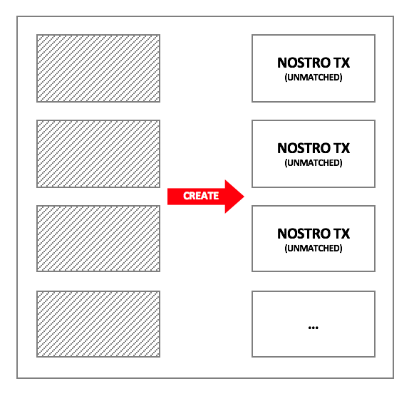

The `addNostroTransactions` calculates a set of bank account IDs affected for each newly added batch of nostro transactions, then returns the timestamp of the last added transaction for each account ID. This is required by the daemons to know which time to poll for transactions from. In the absence of this, the daemon's would poll for all transactions.

#### Event based processing

The issuer node operates a `CordaSerivce` which facilitates event based processing using the node's validated transactions feed. As soon as new transactions are committed to the transaction store, they are emitted by an observable inside this service. Transactions which are emitted are of a finite number of types, such as: adding nostro transactions, verifying bank accounts, adding bank accounts, etc. The service can delineate between each transaction type based upon the commands included, so that transactions can be appropriately handled.

#### Matching nostro transactions to bank account information

Immediately after nostro transactions are added to the node, the transaction containing them is picked up by the event based processor and sent for processing. This involves a processes by which nostro transactions are matched to bank account states: 

1. First, the account numbers in the nostro transaction state are used to lookup bank account states. This will return zero, one or two bank account states.
2. Based upon how many accounts are matched and whether both accounts are controlled by the issuer, or not, some action is taken. The table below outlines the possibilities.

| In / Out | Matched source | Matched Destination | Reason                                                       |
| -------- | -------------- | ------------------- | ------------------------------------------------------------ |
| Incoming | Yes            | No                  | Shouldn't happen                                             |
| Incoming | No             | Yes                 | Payment from unknown account — return to sender              |
| Incoming | No             | No                  | Shouldn't happen                                             |
| Incoming | Yes            | Yes                 | **Match: an issuance, internal transfer or transfer from the issuer's operating account** |
| Outgoing | Yes            | No                  | Shouldn't happen                                             |
| Outgoing | No             | Yes                 | Shouldn't happen                                             |
| Outgoing | No             | No                  | Shouldn't happen                                             |
| Outgoing | Yes            | Yes                 | **Match: a redemption payment, internal transfer or transfer to the issuer's operating account(income sweep)** |

In short, payments into a nostro account can only result in valid cash issuances if the payment originates from a known and verified bank account. Conversely, payments _out_ of collateral accounts can generally only happen in respect of redemptions.

The result of the matching process is an update to nostro transaction state with either an: UNMATCHED, PARTIALLY MATCHED or MATCHED status, as well as an updated transaction type field which can be set to: ISSUANCE, REDEMPTION, COLLATERAL TRANSFER, or INCOME SWEEP.

*The issuance process*

As well as an update to the nostro transaction state an issuance state is created with a pending status. The diagram below depicts the transaction graph for issuances. The issuance state is an extra record which links the nostro transaction state to a cash issuance.

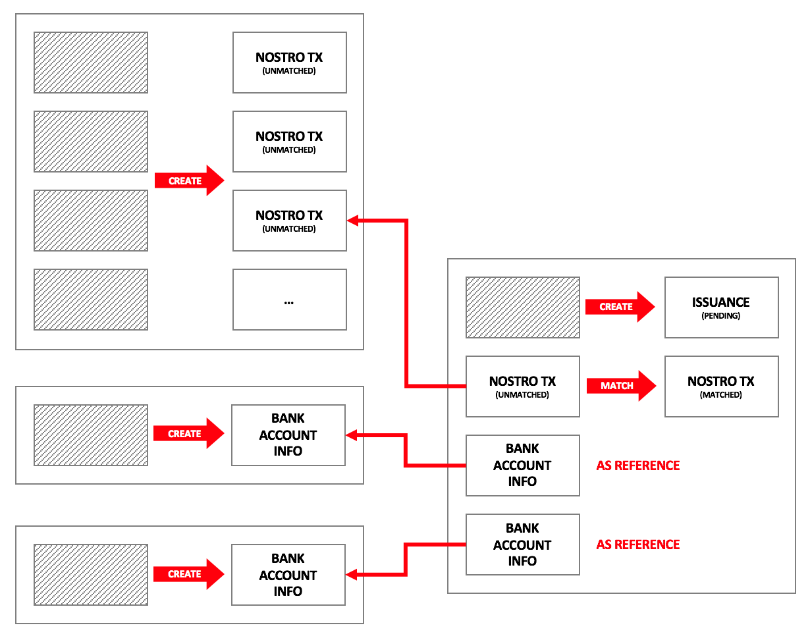

The bank accounts states are not consumed in the _match_ transaction, instead, they are included as reference input states. 

*The redemption process*

For the redemption process, the creation of the redemption state precedes the creation of the nostro transaction states. This is because the cash states are redeemed before any payments are made to the party requesting a redemption. The matching process occurs in the same way as with issuances and other types of transactions.

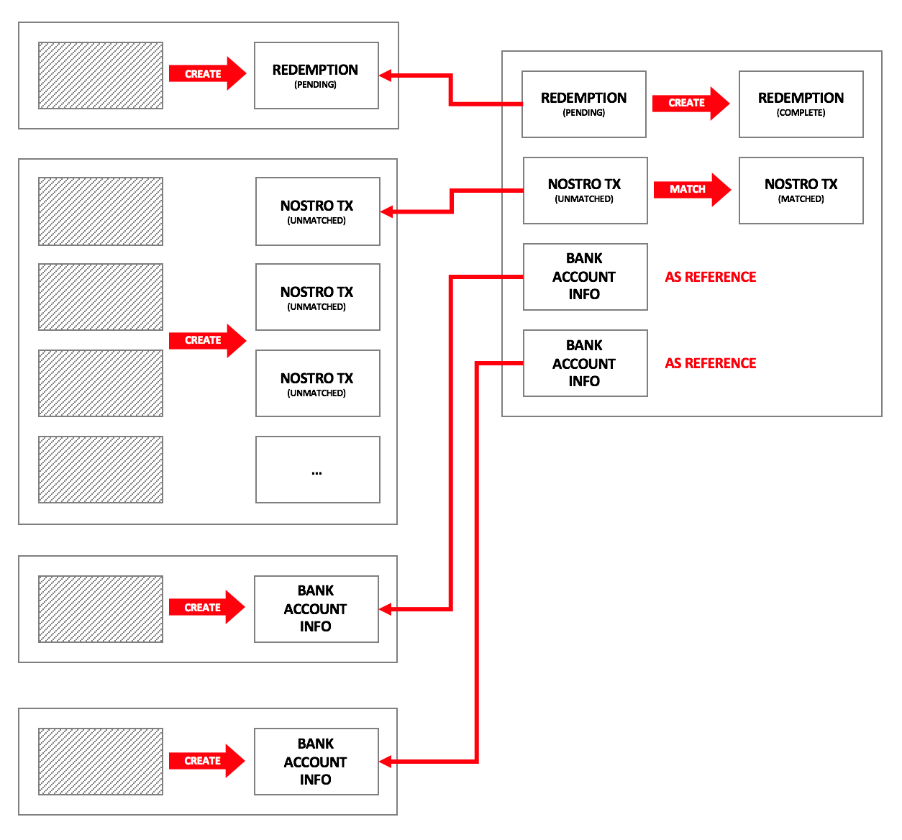

#### Performing issuance transactions

Assuming a nostro transaction pertaining to a payment from a party node with a registered and verified bank is fully matched and assigned as an issuance, then the issuance process can begin.

Here, the event based processor is used to watch for all emitted transactions where  a pending issuance state is created. This pending issuance state is passed into the cash issue flow which creates some new cash states assigned to the requesting party and updates the cash issuance state to complete.

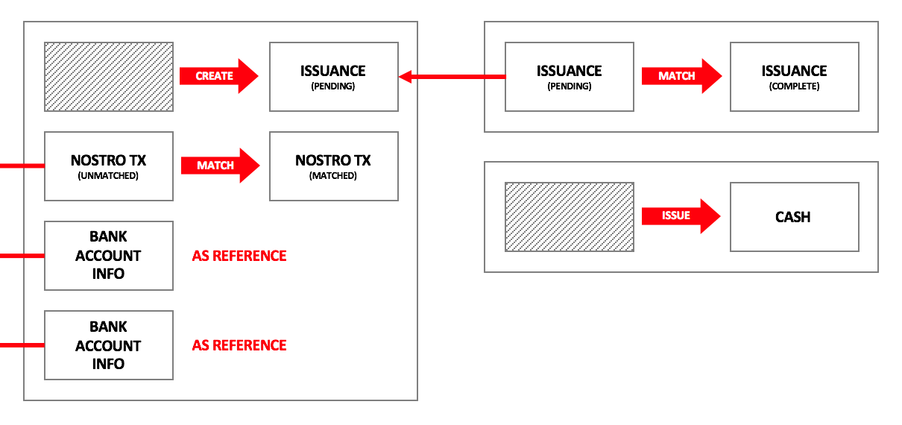

Unfortunately, the cash issuance and matching workflow must be separated, otherwise future holders of the cash state will be able to see the chain of provenance which led up to the issuance, which includes bank account details and other private data. 

#### Accepting and verifying redemption requests

Redemption requests start with an owner of some cash states. The client issuer cash CorDapp comes bundled with a RedeemCash flow which allows owners of cash to submit their cash states for redemption.

The client side of the redemption flow ensures that the cash states sent to the issuer for redemption were issued by the specified issuer in question. For example, if a party requests to redeem £10 of IssuerA cash states but only £8 are available in the vault, then the flow will return an exception. As such, the flow ensures that only the appropriate cash states are sent for redemption.

The redeeming party also sends a map over to the issuer which is keyed with their bank account states and where the values include the amount they would like transferred to each account. The total should be less than equal to the total amount of cash states sent.

When the issuer receives cash states the following operations are performed:

1. The issuer checks the requesting party has successfully completed KYC
2. The issuer checks all states were issued by themselves
3. The chain of provenance is downloaded and validated for all dependency transactions
4. A redemption state is created for the redemption amount specified with a PENDING status, this happens in a separate transaction to the redemption of the cash states
5. The cash states are redeemed via a redeem transaction. Any change is sent back to the requesting party. Change occurs where the amount to redeem is less than the total of the cash states sent for redemption.

As change could possibly be sent back to the requesting party the internal workflows must be performed separately to the redemption transaction itself.

#### Fulfilling redemption requests

Currently redemption payments must be performed manually. This is because none of the banks used support payments via API. This is not necessarily a problem as manual redemptions reduce the operational risk associated with running the issuer entity.

As redemption requests come coupled with a list of bank accounts and amounts to make redemption payments to, the issuer node administrators can make payments manually to these bank accounts.

Redemption states remain pending until the required payments have been made to the account specified by the redeeming party. When made, information about these payments is uploaded to the issuer node via the `addNostroTransactions` flow. These nostro transaction undergo a matching process as usual.

When the nostro transaction state is matched and marked as a redemption then the `processRedemptionPaymentFlow` is started. The approach to match payments to redemptions can be done in two ways:

* Include a sufficiently long random reference string in the redemption state which must be included in the redemption payment descriptions
* Process redemption payments based on a FIFO basis. For example: parties can make multiple redemptions and they are fulfilled by redemption payments in the order in which they were received.

In the absence of autonomous redemption payments, the queuing approach requires the least operational effort. 

#### Performing periodic reconciliations

The issuer node and daemon performs two reconciliations on a periodic basis:

1. **Comparing the sum of all nostro account balances to the amount of cash states currently in issuance.** This reconciliation proves to holders of cash states that their claims on the issuer are fully collateralised. The reconciliation can be performed easily by summing the amount column in the nostro transaction table and comparing it to the sum of issuances less redemptions.
2. **Comparing the bank balance for each bank account to the sum of nostro transactions recorded in the node for each bank account.** This reconciliation is performed to highlight any missing nostro transactions from the node. The reconciliation can be performed via maintaining a schedulable state which is updated every 5 minutes or so. The update to the schedulable state can be used to schedule http calls to query each bank's balance API inside the daemon process. The results of these queries can then be compared with nostro transaction balance per account. Any differences will be due to missing transaction information on the node. The resolution is to query the bank for all transaction IDs from the last check-point and compare against the IDs of nostro transactions stored in the issuer node. 

The issuer cannot perform what are usually termed "internal reconciliations" which compare the sum of the total balances held by each customer to the amount of cash held on its book in respect of party provided collateral. This is because due to the nature of DLT, the issuer is only aware of issuance and redemption transactions. Transaction between parties registered with the issuer are performed on a peer to peer basis without the knowledge of the issuer.

### Daemon processes

The daemon performs four simple processes: polling bank accounts for new transactions and sending batches of transactions to the issuer node for processing, submitting payment instructions (when supported), obtaining bank account information and obtaining bank account balances.

#### Obtaining bank account information

When the daemon starts up for the first time, it will poll all of the available APIs/interfaces for bank account information and add this bank account information to the issuer node as issuer controlled collateral accounts.

#### Polling for and adding new nostro transactions

For the bank accounts which have been added to the issuer node, the daemon can be instructed to poll (or will auto poll) for transactions at pre-defined intervals. The process begins by obtaining the most recent transaction from the node. This is done via a flow which queries the vault for the most recent stored nostro transactions for each collateral account. 

After the latest transaction for each account have been retrieved, then the daemon polls all added bank accounts in parallel.

Every time the AddNostroTransactions is called to add a new batch of nostro transactions, it returns a list of all the IDs and timestamps of the most recent transaction for all the affected accounts. 

Some bank APIs only allow clients to filter transactions on a per day basis, which means past transactions in the same day always get returned by a query. In this case, timestamps can be used to filter out the transactions which are not needed, before sending a new batch of nostro transactions to the node. In any case, the add nostro transaction flow is idempotent, so duplicates will not be stored. 

The daemon stores, in a cache, the last transaction id, and timestamp of the transaction for each bank account.

If no new transactions are returned for a polling event, then the add nostro transactions flow is not called. If there are nostro transactions then the add nostro transactions flow is called.

#### Obtaining bank balances

The daemon can request the current balance with a timestamp for each bank account.

#### Sending payment requests

This is currently performed manually.	

*The "OpenBanking" Daemon*

The first daemon to be built is the open banking daemon, designed to work with UK based banks that offer open banking APIs. Currently, most banks don't offer APIs which conform to the open banking standard, so the daemon allows developers to build API clients for banks of their choice. 

**Dependencies**

* OKhttp3
* Retrofit2
* jolt-simple

**Configuration**

There must be a JAR file for each open banking client and accompanying config file which contains the URL of the API, the version and the API access token. 

**Assumptions**

* All accounts are collateral accounts. This assumption needs to change as some accounts might not be for the purposes of managing collateral. It could be useful for the issuer to control operational account from the daemon to sweep interest income, for example.
* If an account is to be monitored / polled then it requires a config file. The account number in the config file should match the one which the API key is for.

**Data model**

* Whilst the daemon doesn't persist any data to disk, it does store some necessary data in memory: a list of bank account IDs (as provided by the banks) and a map of account ids to timestamps representing the latest transaction stored by the issuer node for each account.

**Mock and real modes**

- The daemon can run in two modes: mock and real
- Mock mode produces semi realistic transactions and sends them to the node. It tells the user which bank accounts to use via the console (as it must create a bunch of mock accounts to fill in the source account for each nostro transaction). These accounts can then be added via other Party nodes.
- Mock mode requires users to start off with a clean vault unless bank accounts are pre specified via a config file. 
- Real mode actually connects to the bank’s APIs

### Risk taxonomy

#### Operational error

- Cash states are issued to an incorrect party
- Redemption payments are made to the wrong party
- The Corda platform fails for any reason

#### Internal fraud

- Rogue employees perform an unauthorised cash issuance, resulting in an apparent deficit of funds in the collateral accounts
- Rogue employees manage to perform a redemption of unauthorised issued cash states, resulting in an actual deficit of funds in the collateral accounts

#### External fraud

- The issuer's private key is stolen

#### Regulatory risk

* Procedures are not properly carried out, resulting in a regulatory breach

#### Reputational risk

* The issuer is unavailable for a period of time, meaning that parties cannot issue or redeem cash to meet their on-ledger obligations

#### Credit risk

* The credit institution holding client money fails, resulting in client losses

### Platform Pre-requirisites

- Reference states
- Generic coin selection
- Durable RPC
- Human interaction
- Tear-offs
